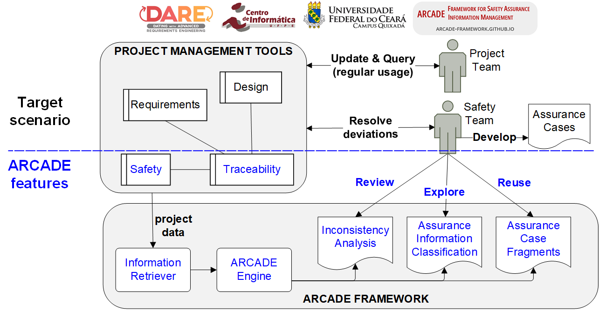

# ARCADE (AssuRance CAse DEvelopment) Framework

This is a supporting page for the **evaluation of ARCADE framework**.

## Context

In critical systems development projects, safety-relevant information (also called assurance information) is key to support the production of certification reports, including Assurance Cases.

Fortunately, much of this information is already stored in project management tools such as issue trackers (Jira and alike).

However, teams may struggle to identify, classify and analyse the project items that are safety-relevant.

ARCADE framework proposes a mechanism to automatically retrieve and process assurance information from issue trackers, to help teams in the identification of gaps and inconsistencies that could hinder certification procedures.

ARCADE framework also generates assurance case fragments based on the project information, helping teams in perform an early and continuous assessment of the quality of assurance information recorded in the issue trackers.

<figure>
<figcaption>ARCADE overview</figcaption>
  
</figure>

## Evaluation

To participate in the evaluation, you need to fill out the informed consent and personal profile questionnaire: https://forms.gle/m7fgSxR2N1TngXff7 

