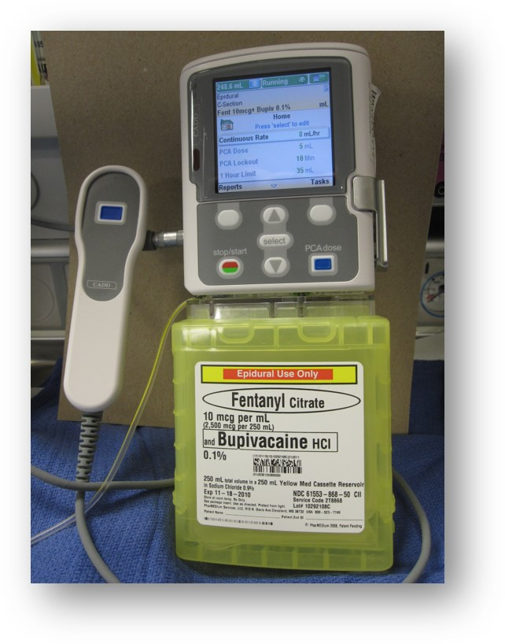
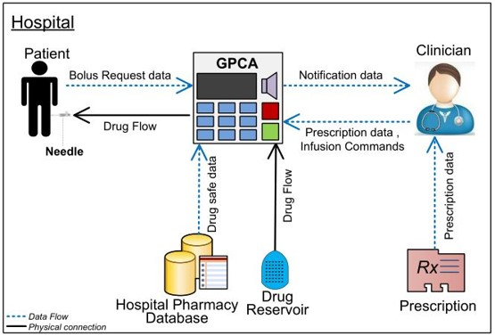

## Open PCA Pump

- The Open Patient Controlled Analgesic (PCA) Pump project provides open source design artifacts
for a realistic a PCA Pump. 
- Link: http://openpcapump.santoslab.org/

Open PCA Pump is used to deliver analgesic in a clinical setting:

Example of real PCA Pump:

Open PCA Pump architecture overview:

