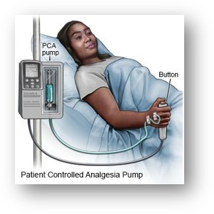

## Open PCA Pump

- The Open Patient Controlled Analgesic (PCA) Pump project provides open source design artifacts
for a realistic a PCA Pump. 
- Link: [http://openpcapump.santoslab.org/](http://openpcapump.santoslab.org/)

Open PCA Pump is used to deliver analgesic in a clinical setting:



Example of real PCA Pump:


Open PCA Pump architecture overview:


### Adapted dataset represented in ARCADE interchange format

```turtle
@prefix : <dare:arcade/sao#> .
@prefix sao: <dare:arcade/sao#> .
@prefix owl: <http://www.w3.org/2002/07/owl#> .
@prefix rdf: <http://www.w3.org/1999/02/22-rdf-syntax-ns#> .
@prefix xml: <http://www.w3.org/XML/1998/namespace> .
@prefix xsd: <http://www.w3.org/2001/XMLSchema#> .
@prefix rdfs: <http://www.w3.org/2000/01/rdf-schema#> .

<dare:arcade/sao> rdf:type owl:Ontology ;
                           owl:imports <dare:0.1> .
:OPENPCA-69 rdf:type owl:NamedIndividual .
:OPENPCA-69 rdf:type sao:Requirement .
:OPENPCA-69 rdfs:label "PCA Pump Interfaces"@en .
:OPENPCA-69 rdfs:comment "Sensors, actuators, alarms."@en .
:OPENPCA-69 sao:status "To Do"@en .
:OPENPCA-69 sao:creationdate "2023-03-03T16:40:47.044-0300"@en .
:OPENPCA-69 sao:lastupdate "2023-03-03T16:46:05.560-0300"@en .
:OPENPCA-69 sao:externaluri "https://arcade-dare.atlassian.net/browse/OPENPCA-69"@en .
:OPENPCA-69 sao:isRefinedBy :OPENPCA-52 .
:OPENPCA-69 sao:isRefinedBy :OPENPCA-54 .
:OPENPCA-69 sao:isRefinedBy :OPENPCA-56 .
:OPENPCA-68 rdf:type owl:NamedIndividual .
:OPENPCA-68 rdf:type sao:Requirement .
:OPENPCA-68 rdfs:label "Max dose warning"@en .
:OPENPCA-68 rdfs:comment "Clinician-commanded bolus shall be halted when continuing to infuse exceeds prescribed volume of drug infused over a period of time (ml/hr). Pump rate shall be reduced to KVO and a max dose warning be issued."@en .
:OPENPCA-68 sao:status "To Do"@en .
:OPENPCA-68 sao:creationdate "2023-03-03T16:31:38.066-0300"@en .
:OPENPCA-68 sao:lastupdate "2023-03-03T16:35:10.327-0300"@en .
:OPENPCA-68 sao:externaluri "https://arcade-dare.atlassian.net/browse/OPENPCA-68"@en .
:OPENPCA-68 sao:refines :OPENPCA-20 .
:OPENPCA-67 rdf:type owl:NamedIndividual .
:OPENPCA-67 rdf:type sao:Requirement .
:OPENPCA-67 rdfs:label "Minimum clinician-chosen duration"@en .
:OPENPCA-67 rdfs:comment "The minimum clinician-chosen duration for a clinician-requested bolus shall be the prescribed minimum number of minutes between consecutive patient-requested bolus deliveries, Δprb."@en .
:OPENPCA-67 sao:status "To Do"@en .
:OPENPCA-67 sao:creationdate "2023-03-03T16:29:11.713-0300"@en .
:OPENPCA-67 sao:lastupdate "2023-03-03T16:35:10.483-0300"@en .
:OPENPCA-67 sao:externaluri "https://arcade-dare.atlassian.net/browse/OPENPCA-67"@en .
:OPENPCA-67 sao:refines :OPENPCA-20 .
:OPENPCA-66 rdf:type owl:NamedIndividual .
:OPENPCA-66 rdf:type sao:Requirement .
:OPENPCA-66 rdfs:label "Maximum clinician-chosen duration"@en .
:OPENPCA-66 rdfs:comment "The maximum clinician-chosen duration for a clinician-requested bolus shall be Δccb max = 6 hours."@en .
:OPENPCA-66 sao:status "To Do"@en .
:OPENPCA-66 sao:creationdate "2023-03-03T16:28:49.585-0300"@en .
:OPENPCA-66 sao:lastupdate "2023-03-03T16:35:10.415-0300"@en .
:OPENPCA-66 sao:externaluri "https://arcade-dare.atlassian.net/browse/OPENPCA-66"@en .
:OPENPCA-66 sao:refines :OPENPCA-20 .
:OPENPCA-65 rdf:type owl:NamedIndividual .
:OPENPCA-65 rdf:type sao:Requirement .
:OPENPCA-65 rdfs:label "Alarm halts clinician-requested bolus"@en .
:OPENPCA-65 rdfs:comment "Any alarm halts clinician-requested bolus delivery either halting pump or switching to KVO rate."@en .
:OPENPCA-65 sao:status "To Do"@en .
:OPENPCA-65 sao:creationdate "2023-03-03T16:27:29.943-0300"@en .
:OPENPCA-65 sao:lastupdate "2023-03-03T16:35:10.343-0300"@en .
:OPENPCA-65 sao:externaluri "https://arcade-dare.atlassian.net/browse/OPENPCA-65"@en .
:OPENPCA-65 sao:refines :OPENPCA-20 .
:OPENPCA-64 rdf:type owl:NamedIndividual .
:OPENPCA-64 rdf:type sao:Requirement .
:OPENPCA-64 rdfs:label "Patient-requested bolus takes precedence"@en .
:OPENPCA-64 rdfs:comment "A patient-requested bolus takes precedence over a clinician-requested bolus. The clinician-requested bolus shall be suspended while the patient-requested bolus dose is administered, and resumed afterward."@en .
:OPENPCA-64 sao:status "To Do"@en .
:OPENPCA-64 sao:creationdate "2023-03-03T16:27:05.060-0300"@en .
:OPENPCA-64 sao:lastupdate "2023-03-03T16:35:10.261-0300"@en .
:OPENPCA-64 sao:externaluri "https://arcade-dare.atlassian.net/browse/OPENPCA-64"@en .
:OPENPCA-64 sao:refines :OPENPCA-20 .
:OPENPCA-63 rdf:type owl:NamedIndividual .
:OPENPCA-63 rdf:type sao:Requirement .
:OPENPCA-63 rdfs:label "Delivery of clinician-requested bolus"@en .
:OPENPCA-63 rdfs:comment "A clinician-requested bolus shall be delivered at the rate, Fccb, of VTBI divided by the duration chosen by the clinician, Δccb, in addition to the prescribed basal flow rate, Fbasal, but no more than the maximum flow rate for the pump, Fmax."@en .
:OPENPCA-63 sao:status "To Do"@en .
:OPENPCA-63 sao:creationdate "2023-03-03T16:26:38.532-0300"@en .
:OPENPCA-63 sao:lastupdate "2023-03-03T16:35:10.458-0300"@en .
:OPENPCA-63 sao:externaluri "https://arcade-dare.atlassian.net/browse/OPENPCA-63"@en .
:OPENPCA-63 sao:refines :OPENPCA-20 .
:OPENPCA-62 rdf:type owl:NamedIndividual .
:OPENPCA-62 rdf:type sao:Requirement .
:OPENPCA-62 rdfs:label "Alarm stops patient-requested bolus"@en .
:OPENPCA-62 rdfs:comment "Any alarm stops patient-requested bolus delivery either halting pump or switching to KVO rate."@en .
:OPENPCA-62 sao:status "To Do"@en .
:OPENPCA-62 sao:creationdate "2023-03-03T16:16:45.004-0300"@en .
:OPENPCA-62 sao:lastupdate "2023-03-03T16:17:17.384-0300"@en .
:OPENPCA-62 sao:externaluri "https://arcade-dare.atlassian.net/browse/OPENPCA-62"@en .
:OPENPCA-62 sao:refines :OPENPCA-22 .
:OPENPCA-61 rdf:type owl:NamedIndividual .
:OPENPCA-61 rdf:type sao:Requirement .
:OPENPCA-61 rdfs:label "Max dose warning"@en .
:OPENPCA-61 rdfs:comment "Patient-requested bolus shall not be delivered if infusing prescribed VTBI will exceed hard limits retrieved from the drug library for the volume of drug infused over a period of time. Pump rate shall be reduced to KVO and a max dose warning be issued."@en .
:OPENPCA-61 sao:status "To Do"@en .
:OPENPCA-61 sao:creationdate "2023-03-03T16:16:17.826-0300"@en .
:OPENPCA-61 sao:lastupdate "2023-03-03T16:17:17.416-0300"@en .
:OPENPCA-61 sao:externaluri "https://arcade-dare.atlassian.net/browse/OPENPCA-61"@en .
:OPENPCA-61 sao:refines :OPENPCA-22 .
:OPENPCA-60 rdf:type owl:NamedIndividual .
:OPENPCA-60 rdf:type sao:Requirement .
:OPENPCA-60 rdfs:label "Basal flow rate"@en .
:OPENPCA-60 rdfs:comment "The basal flow rate, Fbasal, is prescribed by a physician, and entered into the PCA pump by scanning the prescription from the drug container label as it is loaded into the reservoir."@en .
:OPENPCA-60 sao:status "To Do"@en .
:OPENPCA-60 sao:creationdate "2023-03-03T15:23:27.649-0300"@en .
:OPENPCA-60 sao:lastupdate "2023-03-03T15:23:55.135-0300"@en .
:OPENPCA-60 sao:externaluri "https://arcade-dare.atlassian.net/browse/OPENPCA-60"@en .
:OPENPCA-60 sao:refines :OPENPCA-1 .
:OPENPCA-59 rdf:type owl:NamedIndividual .
:OPENPCA-59 rdf:type sao:Requirement .
:OPENPCA-59 rdfs:label "PCA pump performs intended function"@en .
:OPENPCA-59 rdfs:comment "The high-level goals (G) of the PCA pump are:
G0 The pump will safely infuse drugs intravenously for pain relief.
G1 The patient should receive enough drug to reduce his pain.
G2 The patient should not receive so much drug that makes him unaware, or is harmful.
G3 Clinician(s) should be notified upon occurrence of hazardous conditions, unless alarms have been inactivated.
G4 The PCA pump should detect the smallest-possible air-in-line embolism (bubble) and halt the infusion drug.
G5 The PCA pump should infuse safely when failures occur or hazards are detected
G6 Patients should receive the drug as prescribed by their physician, administered by appropriate
clinicians.
G7 Patient’s health information should be available to those caring for the patient, and only those."@en .
:OPENPCA-59 sao:status "To Do"@en .
:OPENPCA-59 sao:creationdate "2023-03-03T10:09:03.165-0300"@en .
:OPENPCA-59 sao:lastupdate "2023-03-03T10:36:44.741-0300"@en .
:OPENPCA-59 sao:externaluri "https://arcade-dare.atlassian.net/browse/OPENPCA-59"@en .
:OPENPCA-59 sao:isRefinedBy :OPENPCA-1 .
:OPENPCA-59 sao:isRefinedBy :OPENPCA-20 .
:OPENPCA-59 sao:isRefinedBy :OPENPCA-22 .
:OPENPCA-59_justification rdf:type owl:NamedIndividual .
:OPENPCA-59_justification rdf:type sao:Justification .
:OPENPCA-59_justification sao:explains :OPENPCA-59 .
:OPENPCA-59 sao:isExplainedBy :OPENPCA-59_justification .
:OPENPCA-59_justification rdfs:label "Divide into individual behaviors, and then argue their composition has intended function"@en .
:OPENPCA-59_assumption rdf:type owl:NamedIndividual .
:OPENPCA-59_assumption rdf:type sao:Assumption .
:OPENPCA-59_assumption sao:explains :OPENPCA-59 .
:OPENPCA-59 sao:isExplainedBy :OPENPCA-59_assumption .
:OPENPCA-59_assumption rdfs:label "Individual behaviors, and intended function, as defined in Requirements"@en .
:OPENPCA-58 rdf:type owl:NamedIndividual .
:OPENPCA-58 rdf:type sao:Hazard .
:OPENPCA-58 rdfs:label "Reverse flow hazard"@en .
:OPENPCA-58 rdfs:comment "Retrograde Flow of Infusate. Potential causes: The pump is positioned much lower than the infusion site, causing the pump to siphon; or The delivery path is damaged, creating a vent on the path that diverts an intentional drug flow from reaching the user."@en .
:OPENPCA-58 sao:status "To Do"@en .
:OPENPCA-58 sao:creationdate "2023-03-02T16:00:40.857-0300"@en .
:OPENPCA-58 sao:lastupdate "2023-03-02T16:08:35.406-0300"@en .
:OPENPCA-58 sao:externaluri "https://arcade-dare.atlassian.net/browse/OPENPCA-58"@en .
:OPENPCA-58 sao:isMitigatedBy :OPENPCA-56 .
:OPENPCA-58 sao:isMitigatedBy :OPENPCA-57 .
:OPENPCA-58_justification rdf:type owl:NamedIndividual .
:OPENPCA-58_justification rdf:type sao:Justification .
:OPENPCA-58_justification sao:explains :OPENPCA-58 .
:OPENPCA-58 sao:isExplainedBy :OPENPCA-58_justification .
:OPENPCA-58_justification rdfs:label "Rely on mechanical design of pumping mechanism"@en .
:OPENPCA-57 rdf:type owl:NamedIndividual .
:OPENPCA-57 rdf:type sao:Requirement .
:OPENPCA-57 rdfs:label "Continuous reverse delivery"@en .
:OPENPCA-57 rdfs:comment "During normal use and/or single fault condition of the equipment, continuous reverse delivery
shall not be possible."@en .
:OPENPCA-57 sao:status "To Do"@en .
:OPENPCA-57 sao:creationdate "2023-03-02T15:57:31.620-0300"@en .
:OPENPCA-57 sao:lastupdate "2023-03-02T16:08:35.333-0300"@en .
:OPENPCA-57 sao:externaluri "https://arcade-dare.atlassian.net/browse/OPENPCA-57"@en .
:OPENPCA-57 sao:mitigates :OPENPCA-58 .
:OPENPCA-56 rdf:type owl:NamedIndividual .
:OPENPCA-56 rdf:type sao:Requirement .
:OPENPCA-56 rdfs:label "Reverse flow"@en .
:OPENPCA-56 rdfs:comment "The mechanical pump shall not allow reverse flow from the patient into the pump."@en .
:OPENPCA-56 sao:status "To Do"@en .
:OPENPCA-56 sao:creationdate "2023-03-02T15:56:47.497-0300"@en .
:OPENPCA-56 sao:lastupdate "2023-03-03T16:44:02.955-0300"@en .
:OPENPCA-56 sao:externaluri "https://arcade-dare.atlassian.net/browse/OPENPCA-56"@en .
:OPENPCA-56 sao:mitigates :OPENPCA-58 .
:OPENPCA-56 sao:refines :OPENPCA-69 .
:OPENPCA-55 rdf:type owl:NamedIndividual .
:OPENPCA-55 rdf:type sao:Requirement .
:OPENPCA-55 rdfs:label "Air-in-line alarm"@en .
:OPENPCA-55 rdfs:comment "An air-in-line alarm shall be triggered by the pump if detectable air bubbles are infused into the patient."@en .
:OPENPCA-55 sao:status "To Do"@en .
:OPENPCA-55 sao:creationdate "2023-03-02T15:51:38.374-0300"@en .
:OPENPCA-55 sao:lastupdate "2023-03-03T16:49:13.530-0300"@en .
:OPENPCA-55 sao:externaluri "https://arcade-dare.atlassian.net/browse/OPENPCA-55"@en .
:OPENPCA-55 sao:mitigates :OPENPCA-6 .
:OPENPCA-55 sao:refines :OPENPCA-8 .
:OPENPCA-54 rdf:type owl:NamedIndividual .
:OPENPCA-54 rdf:type sao:Requirement .
:OPENPCA-54 rdfs:label "Detect air-in-line embolism"@en .
:OPENPCA-54 rdfs:comment "The PCA pump shall detect air-in-line embolism (bubble)."@en .
:OPENPCA-54 sao:status "To Do"@en .
:OPENPCA-54 sao:creationdate "2023-03-02T15:50:05.290-0300"@en .
:OPENPCA-54 sao:lastupdate "2023-03-03T16:44:03.181-0300"@en .
:OPENPCA-54 sao:externaluri "https://arcade-dare.atlassian.net/browse/OPENPCA-54"@en .
:OPENPCA-54 sao:mitigates :OPENPCA-6 .
:OPENPCA-54 sao:refines :OPENPCA-69 .
:OPENPCA-53 rdf:type owl:NamedIndividual .
:OPENPCA-53 rdf:type sao:Strategy .
:OPENPCA-53 rdfs:label "Mitigations of external and internal air in line hazards differ"@en .
:OPENPCA-53 rdfs:comment "Argue for mitigation of internal and external causes  of air in line separately"@en .
:OPENPCA-53 sao:status "To Do"@en .
:OPENPCA-53 sao:creationdate "2023-03-02T15:48:09.119-0300"@en .
:OPENPCA-53 sao:lastupdate "2023-03-02T15:48:24.561-0300"@en .
:OPENPCA-53 sao:externaluri "https://arcade-dare.atlassian.net/browse/OPENPCA-53"@en .
:OPENPCA-53 sao:explains :OPENPCA-6 .
:OPENPCA-52 rdf:type owl:NamedIndividual .
:OPENPCA-52 rdf:type sao:Requirement .
:OPENPCA-52 rdfs:label "Halt pumping"@en .
:OPENPCA-52 rdfs:comment "The mechanical pump shall halt pumping when commanded, or caused in response to an alarm condition.(many EC)"@en .
:OPENPCA-52 sao:status "To Do"@en .
:OPENPCA-52 sao:creationdate "2023-03-02T11:07:42.411-0300"@en .
:OPENPCA-52 sao:lastupdate "2023-03-03T16:44:03.031-0300"@en .
:OPENPCA-52 sao:externaluri "https://arcade-dare.atlassian.net/browse/OPENPCA-52"@en .
:OPENPCA-52 sao:mitigates :OPENPCA-4 .
:OPENPCA-52 sao:refines :OPENPCA-69 .
:OPENPCA-52 sao:isAllocatedIn :Component10031 .
:Component10031 sao:allocates :OPENPCA-52 .
:OPENPCA-51 rdf:type owl:NamedIndividual .
:OPENPCA-51 rdf:type sao:Requirement .
:OPENPCA-51 rdfs:label "Square bolus under-infusion warning"@en .
:OPENPCA-51 rdfs:comment "If delivered clinician-requested bolus flow rate is less than the calculated square bolus rate by more than its allowed tolerance over a period of more than 5 minutes, or immediately if the flow stops, the pump shall issue a square bolus under-infusion warning."@en .
:OPENPCA-51 sao:status "To Do"@en .
:OPENPCA-51 sao:creationdate "2023-03-02T10:08:18.452-0300"@en .
:OPENPCA-51 sao:lastupdate "2023-03-02T10:24:04.132-0300"@en .
:OPENPCA-51 sao:externaluri "https://arcade-dare.atlassian.net/browse/OPENPCA-51"@en .
:OPENPCA-51 sao:mitigates :OPENPCA-30 .
:OPENPCA-51 sao:isAllocatedIn :Component10020 .
:Component10020 sao:allocates :OPENPCA-51 .
:OPENPCA-50 rdf:type owl:NamedIndividual .
:OPENPCA-50 rdf:type sao:Requirement .
:OPENPCA-50 rdfs:label "Square bolus over-infusion alarm"@en .
:OPENPCA-50 rdfs:comment "If delivered clinician-requested bolus flow rate exceeds the calculated square bolus rate by more than its allowed tolerance over a period of more than 5 minutes, or immediately if the pump goes into free flow, the pump shall issue a square bolus over-infusion alarm."@en .
:OPENPCA-50 sao:status "To Do"@en .
:OPENPCA-50 sao:creationdate "2023-03-02T10:03:08.045-0300"@en .
:OPENPCA-50 sao:lastupdate "2023-03-03T16:45:47.048-0300"@en .
:OPENPCA-50 sao:externaluri "https://arcade-dare.atlassian.net/browse/OPENPCA-50"@en .
:OPENPCA-50 sao:mitigates :OPENPCA-30 .
:OPENPCA-50 sao:isAllocatedIn :Component10020 .
:Component10020 sao:allocates :OPENPCA-50 .
:OPENPCA-49 rdf:type owl:NamedIndividual .
:OPENPCA-49 rdf:type sao:Requirement .
:OPENPCA-49 rdfs:label "Bolus under-infusion warning"@en .
:OPENPCA-49 rdfs:comment "If delivered patient-requested bolus flow rate is less than the prescribed bolus rate setting by more than its allowed tolerance over a period of more than 1 minutes, or immediately if the flow stops, the pump shall issue a bolus under-infusion warning."@en .
:OPENPCA-49 sao:status "To Do"@en .
:OPENPCA-49 sao:creationdate "2023-03-02T10:01:49.620-0300"@en .
:OPENPCA-49 sao:lastupdate "2023-03-02T10:24:04.249-0300"@en .
:OPENPCA-49 sao:externaluri "https://arcade-dare.atlassian.net/browse/OPENPCA-49"@en .
:OPENPCA-49 sao:mitigates :OPENPCA-30 .
:OPENPCA-49 sao:isAllocatedIn :Component10020 .
:Component10020 sao:allocates :OPENPCA-49 .
:OPENPCA-48 rdf:type owl:NamedIndividual .
:OPENPCA-48 rdf:type sao:Requirement .
:OPENPCA-48 rdfs:label "Bolus over-infusion alarm"@en .
:OPENPCA-48 rdfs:comment "If delivered patient-requested bolus flow rate exceeds the prescribed patient-requested bolus rate setting by more than its allowed tolerance over a period of more than 1 minutes, or immediately if the pump goes into free flow, the pump shall issue a bolus over-infusion alarm."@en .
:OPENPCA-48 sao:status "To Do"@en .
:OPENPCA-48 sao:creationdate "2023-03-02T10:00:45.950-0300"@en .
:OPENPCA-48 sao:lastupdate "2023-03-02T10:24:03.948-0300"@en .
:OPENPCA-48 sao:externaluri "https://arcade-dare.atlassian.net/browse/OPENPCA-48"@en .
:OPENPCA-48 sao:mitigates :OPENPCA-30 .
:OPENPCA-48 sao:isAllocatedIn :Component10020 .
:Component10020 sao:allocates :OPENPCA-48 .
:OPENPCA-47 rdf:type owl:NamedIndividual .
:OPENPCA-47 rdf:type sao:Requirement .
:OPENPCA-47 rdfs:label "Basal under-infusion warning"@en .
:OPENPCA-47 rdfs:comment "If delivered basal flow rate is less than the prescribed basal rate setting by more than its allowed tolerance over a period of more than 5 minutes, or immediately if the flow stops, the pump shall issue an basal under-infusion warning."@en .
:OPENPCA-47 sao:status "To Do"@en .
:OPENPCA-47 sao:creationdate "2023-03-02T09:59:18.705-0300"@en .
:OPENPCA-47 sao:lastupdate "2023-03-02T10:24:04.540-0300"@en .
:OPENPCA-47 sao:externaluri "https://arcade-dare.atlassian.net/browse/OPENPCA-47"@en .
:OPENPCA-47 sao:mitigates :OPENPCA-30 .
:OPENPCA-47 sao:isAllocatedIn :Component10020 .
:Component10020 sao:allocates :OPENPCA-47 .
:OPENPCA-46 rdf:type owl:NamedIndividual .
:OPENPCA-46 rdf:type sao:Requirement .
:OPENPCA-46 rdfs:label "Basal over-infusion alarm"@en .
:OPENPCA-46 rdfs:comment "If delivered basal flow rate exceeds the prescribed basal rate setting by more than its allowed tolerance over a period of more than 5 minutes, or immediately if the pump goes into free flow, the pump shall issue an basal over-infusion alarm"@en .
:OPENPCA-46 sao:status "To Do"@en .
:OPENPCA-46 sao:creationdate "2023-03-02T09:55:22.406-0300"@en .
:OPENPCA-46 sao:lastupdate "2023-03-03T16:45:44.476-0300"@en .
:OPENPCA-46 sao:externaluri "https://arcade-dare.atlassian.net/browse/OPENPCA-46"@en .
:OPENPCA-46 sao:mitigates :OPENPCA-30 .
:OPENPCA-46 sao:isAllocatedIn :Component10020 .
:Component10020 sao:allocates :OPENPCA-46 .
:OPENPCA-45 rdf:type owl:NamedIndividual .
:OPENPCA-45 rdf:type sao:DesignDefinition .
:OPENPCA-45 rdfs:label "Safety architecture specification"@en .
:OPENPCA-45 rdfs:comment "Generic Patient Controlled Analgesic Infusion Architectural Model Description"@en .
:OPENPCA-45 sao:status "To Do"@en .
:OPENPCA-45 sao:creationdate "2023-03-02T09:34:07.619-0300"@en .
:OPENPCA-45 sao:lastupdate "2023-03-02T09:35:59.149-0300"@en .
:OPENPCA-45 sao:externaluri "https://arcade-dare.atlassian.net/browse/OPENPCA-45"@en .
:OPENPCA-45 sao:realizes :OPENPCA-40 .
:Source10017 rdf:type owl:NamedIndividual .
:Source10017 rdf:type sao:Source .
:OPENPCA-45 sao:isDocumentedBy :Source10017 .
:Source10017 rdfs:comment "Attachment" .
:Source10017 rdfs:label "Generic Patient Controlled Analgesic Infusion Architectural Model Description.pdf" .
:Source10017 sao:externaluri "https://arcade-dare.atlassian.net/rest/api/3/attachment/content/10017" .
:Source10017 sao:creationdate "2023-03-02T09:34:52.626-0300" .
:OPENPCA-44 rdf:type owl:NamedIndividual .
:OPENPCA-44 rdf:type sao:Context .
:OPENPCA-44 rdfs:label "Generic Patient Controlled Analgesia Pump Hazard Analysis "@en .
:OPENPCA-44 sao:status "To Do"@en .
:OPENPCA-44 sao:creationdate "2023-03-01T15:35:33.935-0300"@en .
:OPENPCA-44 sao:lastupdate "2023-03-01T15:37:03.082-0300"@en .
:OPENPCA-44 sao:externaluri "https://arcade-dare.atlassian.net/browse/OPENPCA-44"@en .
:OPENPCA-44 sao:contextualizes :OPENPCA-4 .
:OPENPCA-44 sao:contextualizes :OPENPCA-5 .
:OPENPCA-44 sao:contextualizes :OPENPCA-6 .
:OPENPCA-44 sao:contextualizes :OPENPCA-30 .
:OPENPCA-44 sao:contextualizes :OPENPCA-31 .
:OPENPCA-44 sao:contextualizes :OPENPCA-41 .
:Source10016 rdf:type owl:NamedIndividual .
:Source10016 rdf:type sao:Source .
:OPENPCA-44 sao:isDocumentedBy :Source10016 .
:Source10016 rdfs:comment "Attachment" .
:Source10016 rdfs:label "Hazard_Analysis_GPCA.pdf" .
:Source10016 sao:externaluri "https://arcade-dare.atlassian.net/rest/api/3/attachment/content/10016" .
:Source10016 sao:creationdate "2023-03-01T15:36:02.914-0300" .
:OPENPCA-43 rdf:type owl:NamedIndividual .
:OPENPCA-43 rdf:type sao:Context .
:OPENPCA-43 rdfs:label "Open PCA Pump Architecture Overview"@en .
:OPENPCA-43 sao:status "To Do"@en .
:OPENPCA-43 sao:creationdate "2023-03-01T10:28:30.090-0300"@en .
:OPENPCA-43 sao:lastupdate "2023-03-01T10:30:19.425-0300"@en .
:OPENPCA-43 sao:externaluri "https://arcade-dare.atlassian.net/browse/OPENPCA-43"@en .
:Source10015 rdf:type owl:NamedIndividual .
:Source10015 rdf:type sao:Source .
:OPENPCA-43 sao:isDocumentedBy :Source10015 .
:Source10015 rdfs:comment "Attachment" .
:Source10015 rdfs:label "PCA-Pump--Architecture-Overview.pdf" .
:Source10015 sao:externaluri "https://arcade-dare.atlassian.net/rest/api/3/attachment/content/10015" .
:Source10015 sao:creationdate "2023-03-01T10:30:19.093-0300" .
:OPENPCA-42 rdf:type owl:NamedIndividual .
:OPENPCA-42 rdf:type sao:Context .
:OPENPCA-42 rdfs:label "Open PCA Pump Requirements Specification"@en .
:OPENPCA-42 sao:status "To Do"@en .
:OPENPCA-42 sao:creationdate "2023-03-01T10:26:26.596-0300"@en .
:OPENPCA-42 sao:lastupdate "2023-03-02T16:37:09.623-0300"@en .
:OPENPCA-42 sao:externaluri "https://arcade-dare.atlassian.net/browse/OPENPCA-42"@en .
:OPENPCA-42 sao:contextualizes :OPENPCA-1 .
:Source10014 rdf:type owl:NamedIndividual .
:Source10014 rdf:type sao:Source .
:OPENPCA-42 sao:isDocumentedBy :Source10014 .
:Source10014 rdfs:comment "Attachment" .
:Source10014 rdfs:label "Open-PCA-Pump-Requirements.pdf" .
:Source10014 sao:externaluri "https://arcade-dare.atlassian.net/rest/api/3/attachment/content/10014" .
:Source10014 sao:creationdate "2023-03-01T10:27:58.773-0300" .
:OPENPCA-41 rdf:type owl:NamedIndividual .
:OPENPCA-41 rdf:type sao:Hazard .
:OPENPCA-41 rdfs:label "System failure"@en .
:OPENPCA-41 sao:status "To Do"@en .
:OPENPCA-41 sao:creationdate "2023-03-01T10:22:28.801-0300"@en .
:OPENPCA-41 sao:lastupdate "2023-03-01T15:47:44.095-0300"@en .
:OPENPCA-41 sao:externaluri "https://arcade-dare.atlassian.net/browse/OPENPCA-41"@en .
:OPENPCA-41 sao:isContextualizedBy :OPENPCA-44 .
:OPENPCA-41 sao:isMitigatedBy :OPENPCA-40 .
:OPENPCA-41_assumption rdf:type owl:NamedIndividual .
:OPENPCA-41_assumption rdf:type sao:Assumption .
:OPENPCA-41_assumption sao:explains :OPENPCA-41 .
:OPENPCA-41 sao:isExplainedBy :OPENPCA-41_assumption .
:OPENPCA-41_assumption rdfs:label "Separate safety architecture detects and mitigates faults in operation"@en .
:OPENPCA-40 rdf:type owl:NamedIndividual .
:OPENPCA-40 rdf:type sao:Requirement .
:OPENPCA-40 rdfs:label "Safety architecture separates normal operation from fault detection and response"@en .
:OPENPCA-40 rdfs:comment "The PCA pump shall implement a safety architecture that separates normal operation from fault
detection and response."@en .
:OPENPCA-40 sao:status "To Do"@en .
:OPENPCA-40 sao:creationdate "2023-02-28T16:07:23.268-0300"@en .
:OPENPCA-40 sao:lastupdate "2023-03-02T09:35:59.216-0300"@en .
:OPENPCA-40 sao:externaluri "https://arcade-dare.atlassian.net/browse/OPENPCA-40"@en .
:OPENPCA-40 sao:mitigates :OPENPCA-41 .
:OPENPCA-40 sao:isRealizedBy :OPENPCA-45 .
:OPENPCA-39 rdf:type owl:NamedIndividual .
:OPENPCA-39 rdf:type sao:Context .
:OPENPCA-39 rdfs:label "IEC 60601-2-24"@en .
:OPENPCA-39 rdfs:comment "IEC 60601-2-24 Particular Requirements for safety of infusion pumps and controllers"@en .
:OPENPCA-39 sao:status "To Do"@en .
:OPENPCA-39 sao:creationdate "2023-02-28T16:05:39.362-0300"@en .
:OPENPCA-39 sao:lastupdate "2023-02-28T16:05:39.362-0300"@en .
:OPENPCA-39 sao:externaluri "https://arcade-dare.atlassian.net/browse/OPENPCA-39"@en .
:OPENPCA-38 rdf:type owl:NamedIndividual .
:OPENPCA-38 rdf:type sao:Context .
:OPENPCA-38 rdfs:label "SAE International AS5506B"@en .
:OPENPCA-38 rdfs:comment "SAE International AS5506B Architecture Analysis & Design Language (AADL)"@en .
:OPENPCA-38 sao:status "To Do"@en .
:OPENPCA-38 sao:creationdate "2023-02-28T16:05:22.821-0300"@en .
:OPENPCA-38 sao:lastupdate "2023-02-28T16:05:22.821-0300"@en .
:OPENPCA-38 sao:externaluri "https://arcade-dare.atlassian.net/browse/OPENPCA-38"@en .
:OPENPCA-37 rdf:type owl:NamedIndividual .
:OPENPCA-37 rdf:type sao:Context .
:OPENPCA-37 rdfs:label "IEC 60601-1-2 (2001)"@en .
:OPENPCA-37 rdfs:comment "IEC 60601-1-2 (2001) Medical Electrical Equipment, Part 1: General Requirements for Safety, 2. Collateral Standard: Electromagnetic Compatibility - Requirements and Tests"@en .
:OPENPCA-37 sao:status "To Do"@en .
:OPENPCA-37 sao:creationdate "2023-02-28T16:05:04.808-0300"@en .
:OPENPCA-37 sao:lastupdate "2023-02-28T16:05:04.808-0300"@en .
:OPENPCA-37 sao:externaluri "https://arcade-dare.atlassian.net/browse/OPENPCA-37"@en .
:OPENPCA-36 rdf:type owl:NamedIndividual .
:OPENPCA-36 rdf:type sao:Context .
:OPENPCA-36 rdfs:label "IEC 60601-1"@en .
:OPENPCA-36 rdfs:comment "IEC 60601-1 Collateral Standard: Safety requirements for medical electrical systems"@en .
:OPENPCA-36 sao:status "To Do"@en .
:OPENPCA-36 sao:creationdate "2023-02-28T16:04:46.048-0300"@en .
:OPENPCA-36 sao:lastupdate "2023-02-28T16:04:46.048-0300"@en .
:OPENPCA-36 sao:externaluri "https://arcade-dare.atlassian.net/browse/OPENPCA-36"@en .
:OPENPCA-35 rdf:type owl:NamedIndividual .
:OPENPCA-35 rdf:type sao:Context .
:OPENPCA-35 rdfs:label "IEC 60601-1 (1988)"@en .
:OPENPCA-35 rdfs:comment "IEC 60601-1 (1988) Medical electrical equipment Part 1: General requirements for safety, including Amendment 1 (1991) and Amendment 2 (1995) for Type B equipment"@en .
:OPENPCA-35 sao:status "To Do"@en .
:OPENPCA-35 sao:creationdate "2023-02-28T16:04:19.186-0300"@en .
:OPENPCA-35 sao:lastupdate "2023-02-28T16:04:19.186-0300"@en .
:OPENPCA-35 sao:externaluri "https://arcade-dare.atlassian.net/browse/OPENPCA-35"@en .
:OPENPCA-34 rdf:type owl:NamedIndividual .
:OPENPCA-34 rdf:type sao:Context .
:OPENPCA-34 rdfs:label "IEC 60601-1-8"@en .
:OPENPCA-34 rdfs:comment "IEC 60601-1-8 Medical electrical equipment Part 1-8: General requirements for basic safety and essential performance Collateral Standard: General requirements, tests and guidance for alarm systems in medical electrical equipment and medical electrical systems"@en .
:OPENPCA-34 sao:status "To Do"@en .
:OPENPCA-34 sao:creationdate "2023-02-28T16:04:01.265-0300"@en .
:OPENPCA-34 sao:lastupdate "2023-02-28T16:04:01.265-0300"@en .
:OPENPCA-34 sao:externaluri "https://arcade-dare.atlassian.net/browse/OPENPCA-34"@en .
:OPENPCA-33 rdf:type owl:NamedIndividual .
:OPENPCA-33 rdf:type sao:Context .
:OPENPCA-33 rdfs:label "ASTM International F2761-09"@en .
:OPENPCA-33 rdfs:comment "ASTM International F2761-09 Medical Devices and Medical Systems–Essential safety requirements for equipment comprising the patient-centric integrated clinical environment (ICE)–Part 1 General requirements and conceptual model"@en .
:OPENPCA-33 sao:status "To Do"@en .
:OPENPCA-33 sao:creationdate "2023-02-28T16:03:39.230-0300"@en .
:OPENPCA-33 sao:lastupdate "2023-02-28T16:03:39.230-0300"@en .
:OPENPCA-33 sao:externaluri "https://arcade-dare.atlassian.net/browse/OPENPCA-33"@en .
:OPENPCA-31 rdf:type owl:NamedIndividual .
:OPENPCA-31 rdf:type sao:Hazard .
:OPENPCA-31 rdfs:label "Too Many User Boluses Hazard"@en .
:OPENPCA-31 rdfs:comment "Excessive bolus administration due to too many bolus requests from the user. The bolus history records are corrupted,  making the user unable to track previously received boluses."@en .
:OPENPCA-31 sao:status "To Do"@en .
:OPENPCA-31 sao:creationdate "2023-02-28T10:30:14.335-0300"@en .
:OPENPCA-31 sao:lastupdate "2023-03-07T08:46:15.009-0300"@en .
:OPENPCA-31 sao:externaluri "https://arcade-dare.atlassian.net/browse/OPENPCA-31"@en .
:OPENPCA-31 sao:isContextualizedBy :OPENPCA-44 .
:OPENPCA-31 sao:isCausedBy :OPENPCA-16 .
:OPENPCA-31 sao:isCausedBy :OPENPCA-20 .
:OPENPCA-31 sao:isCausedBy :OPENPCA-22 .
:OPENPCA-31 sao:isCausedBy :OPENPCA-26 .
:OPENPCA-31 sao:isMitigatedBy :OPENPCA-24 .
:OPENPCA-30 rdf:type owl:NamedIndividual .
:OPENPCA-30 rdf:type sao:Hazard .
:OPENPCA-30 rdfs:label "Uneven delivery hazard"@en .
:OPENPCA-30 rdfs:comment "The programmed bolus dose is delivered unevenly over its specified duration. Potential causes: Algorithmic errors, The pump motor does not operate as intended."@en .
:OPENPCA-30 sao:status "To Do"@en .
:OPENPCA-30 sao:creationdate "2023-02-28T10:30:36.746-0300"@en .
:OPENPCA-30 sao:lastupdate "2023-03-02T10:08:34.879-0300"@en .
:OPENPCA-30 sao:externaluri "https://arcade-dare.atlassian.net/browse/OPENPCA-30"@en .
:OPENPCA-30 sao:isContextualizedBy :OPENPCA-44 .
:OPENPCA-30 sao:isCausedBy :OPENPCA-16 .
:OPENPCA-30 sao:isExplainedBy :OPENPCA-28 .
:OPENPCA-30 sao:isMitigatedBy :OPENPCA-46 .
:OPENPCA-30 sao:isMitigatedBy :OPENPCA-47 .
:OPENPCA-30 sao:isMitigatedBy :OPENPCA-48 .
:OPENPCA-30 sao:isMitigatedBy :OPENPCA-49 .
:OPENPCA-30 sao:isMitigatedBy :OPENPCA-50 .
:OPENPCA-30 sao:isMitigatedBy :OPENPCA-51 .
:OPENPCA-30_assumption rdf:type owl:NamedIndividual .
:OPENPCA-30_assumption rdf:type sao:Assumption .
:OPENPCA-30_assumption sao:explains :OPENPCA-30 .
:OPENPCA-30 sao:isExplainedBy :OPENPCA-30_assumption .
:OPENPCA-30_assumption rdfs:label "Alarming upon uneven delivery stops flow and hails clinician."@en .
:OPENPCA-29 rdf:type owl:NamedIndividual .
:OPENPCA-29 rdf:type sao:SafetyRequirement .
:OPENPCA-29 rdfs:label "Basal infusion flow range"@en .
:OPENPCA-29 rdfs:comment "The pump shall be able to deliver basal infusion at flows throughout the basal infusion flow range of min = 1ml/hour to max =10 ml/hour."@en .
:OPENPCA-29 sao:status "To Do"@en .
:OPENPCA-29 sao:creationdate "2023-02-28T10:30:18.651-0300"@en .
:OPENPCA-29 sao:lastupdate "2023-03-03T15:24:32.177-0300"@en .
:OPENPCA-29 sao:externaluri "https://arcade-dare.atlassian.net/browse/OPENPCA-29"@en .
:OPENPCA-29 sao:refines :OPENPCA-1 .
:OPENPCA-29 sao:isAllocatedIn :Component10017 .
:Component10017 sao:allocates :OPENPCA-29 .
:OPENPCA-29_justification rdf:type owl:NamedIndividual .
:OPENPCA-29_justification rdf:type sao:Justification .
:OPENPCA-29_justification sao:explains :OPENPCA-29 .
:OPENPCA-29 sao:isExplainedBy :OPENPCA-29_justification .
:OPENPCA-29_justification rdfs:label "Users cannot bypass software limits on dose parameters."@en .
:OPENPCA-28 rdf:type owl:NamedIndividual .
:OPENPCA-28 rdf:type sao:Strategy .
:OPENPCA-28 rdfs:label "Measure drug flow and alarm"@en .
:OPENPCA-28 rdfs:comment "Measure drug flow and alarm if measurement differs from intended flow rate by more than allowed tolerance."@en .
:OPENPCA-28 sao:status "To Do"@en .
:OPENPCA-28 sao:creationdate "2023-02-28T10:30:22.574-0300"@en .
:OPENPCA-28 sao:lastupdate "2023-03-02T10:47:37.328-0300"@en .
:OPENPCA-28 sao:externaluri "https://arcade-dare.atlassian.net/browse/OPENPCA-28"@en .
:OPENPCA-28 sao:explains :OPENPCA-30 .
:OPENPCA-27 rdf:type owl:NamedIndividual .
:OPENPCA-27 rdf:type sao:SafetyRequirement .
:OPENPCA-27 rdfs:label "Basal infusion flow tolerance"@en .
:OPENPCA-27 rdfs:comment "The pump shall deliver basal infusion at the prescribed basal rate within a basal infusion flow tolerance of tolerance = 0.5 ml/hour of the prescribed basal rate."@en .
:OPENPCA-27 sao:status "To Do"@en .
:OPENPCA-27 sao:creationdate "2023-02-28T10:30:20.889-0300"@en .
:OPENPCA-27 sao:lastupdate "2023-03-03T15:27:04.361-0300"@en .
:OPENPCA-27 sao:externaluri "https://arcade-dare.atlassian.net/browse/OPENPCA-27"@en .
:OPENPCA-27 sao:refines :OPENPCA-1 .
:OPENPCA-27 sao:isAllocatedIn :Component10017 .
:Component10017 sao:allocates :OPENPCA-27 .
:OPENPCA-27_justification rdf:type owl:NamedIndividual .
:OPENPCA-27_justification rdf:type sao:Justification .
:OPENPCA-27_justification sao:explains :OPENPCA-27 .
:OPENPCA-27 sao:isExplainedBy :OPENPCA-27_justification .
:OPENPCA-27_justification rdfs:label "the tolerance of rate is adequated to avoid under and over-delivery of drug."@en .
:OPENPCA-26 rdf:type owl:NamedIndividual .
:OPENPCA-26 rdf:type sao:Requirement .
:OPENPCA-26 rdfs:label "Delivery of patient-requested bolus"@en .
:OPENPCA-26 rdfs:comment "A patient-requested bolus shall be delivered at its prescribed rate, Fbolus, in addition to the prescribed basal flow rate, Fbasal, but no more than the maximum flow rate for the pump, Fmax."@en .
:OPENPCA-26 sao:status "To Do"@en .
:OPENPCA-26 sao:creationdate "2023-02-28T10:30:12.483-0300"@en .
:OPENPCA-26 sao:lastupdate "2023-04-19T09:42:14.443-0300"@en .
:OPENPCA-26 sao:externaluri "https://arcade-dare.atlassian.net/browse/OPENPCA-26"@en .
:OPENPCA-26 sao:causes :OPENPCA-31 .
:OPENPCA-26 sao:refines :OPENPCA-22 .
:OPENPCA-26 sao:isAllocatedIn :Component10016 .
:Component10016 sao:allocates :OPENPCA-26 .
:OPENPCA-24 rdf:type owl:NamedIndividual .
:OPENPCA-24 rdf:type sao:SafetyRequirement .
:OPENPCA-24 rdfs:label "Minimum time between patient-request bolus"@en .
:OPENPCA-24 rdfs:comment "Patient-requested bolus shall not be delivered more often than a prescribed minimum time between patient-requested bolus."@en .
:OPENPCA-24 sao:status "To Do"@en .
:OPENPCA-24 sao:creationdate "2023-02-28T10:30:25.921-0300"@en .
:OPENPCA-24 sao:lastupdate "2023-03-02T14:53:52.928-0300"@en .
:OPENPCA-24 sao:externaluri "https://arcade-dare.atlassian.net/browse/OPENPCA-24"@en .
:OPENPCA-24 sao:mitigates :OPENPCA-31 .
:OPENPCA-24 sao:refines :OPENPCA-22 .
:OPENPCA-24 sao:isAllocatedIn :Component10030 .
:Component10030 sao:allocates :OPENPCA-24 .
:OPENPCA-24_justification rdf:type owl:NamedIndividual .
:OPENPCA-24_justification rdf:type sao:Justification .
:OPENPCA-24_justification sao:explains :OPENPCA-24 .
:OPENPCA-24 sao:isExplainedBy :OPENPCA-24_justification .
:OPENPCA-24_justification rdfs:label "Enforcing minimum time between boluses prevents too many user boluses, avoiding overinfusion."@en .
:OPENPCA-23 rdf:type owl:NamedIndividual .
:OPENPCA-23 rdf:type sao:SafetyRequirement .
:OPENPCA-23 rdfs:label "Maximum VTBI"@en .
:OPENPCA-23 rdfs:comment "Prescribed VTBI and rate shall not exceed the maximum VTBI limit set by the drug library from the hospital pharmacy for the drug loaded in the PCA pump."@en .
:OPENPCA-23 sao:status "To Do"@en .
:OPENPCA-23 sao:creationdate "2023-02-28T10:30:24.389-0300"@en .
:OPENPCA-23 sao:lastupdate "2023-03-03T16:15:34.561-0300"@en .
:OPENPCA-23 sao:externaluri "https://arcade-dare.atlassian.net/browse/OPENPCA-23"@en .
:OPENPCA-23 sao:refines :OPENPCA-22 .
:OPENPCA-23 sao:isAllocatedIn :Component10017 .
:Component10017 sao:allocates :OPENPCA-23 .
:OPENPCA-23_justification rdf:type owl:NamedIndividual .
:OPENPCA-23_justification rdf:type sao:Justification .
:OPENPCA-23_justification sao:explains :OPENPCA-23 .
:OPENPCA-23 sao:isExplainedBy :OPENPCA-23_justification .
:OPENPCA-23_justification rdfs:label "Upon a patient-requested dose, the maximum flow rate is checked."@en .
:OPENPCA-22 rdf:type owl:NamedIndividual .
:OPENPCA-22 rdf:type sao:Requirement .
:OPENPCA-22 rdfs:label "Patient-Requested Bolus"@en .
:OPENPCA-22 rdfs:comment "Upon patient’s press of the PCA pump’s patient-button, a prescribed bolus volume-to-be-infused, VTBI, of the drug loaded in the pump is delivered to the patient."@en .
:OPENPCA-22 sao:status "To Do"@en .
:OPENPCA-22 sao:creationdate "2023-02-28T10:30:09.063-0300"@en .
:OPENPCA-22 sao:lastupdate "2023-04-12T16:03:52.243-0300"@en .
:OPENPCA-22 sao:externaluri "https://arcade-dare.atlassian.net/browse/OPENPCA-22"@en .
:OPENPCA-22 sao:causes :OPENPCA-31 .
:OPENPCA-22 sao:refines :OPENPCA-59 .
:OPENPCA-22 sao:isRefinedBy :OPENPCA-23 .
:OPENPCA-22 sao:isRefinedBy :OPENPCA-24 .
:OPENPCA-22 sao:isRefinedBy :OPENPCA-26 .
:OPENPCA-22 sao:isRefinedBy :OPENPCA-61 .
:OPENPCA-22 sao:isRefinedBy :OPENPCA-62 .
:OPENPCA-21 rdf:type owl:NamedIndividual .
:OPENPCA-21 rdf:type sao:Requirement .
:OPENPCA-21 rdfs:label "Patient authentication"@en .
:OPENPCA-21 rdfs:comment "Patient’s identity and admittance to the hospital must be authenticated."@en .
:OPENPCA-21 sao:status "To Do"@en .
:OPENPCA-21 sao:creationdate "2023-02-28T10:30:29.672-0300"@en .
:OPENPCA-21 sao:lastupdate "2023-03-03T16:11:34.378-0300"@en .
:OPENPCA-21 sao:externaluri "https://arcade-dare.atlassian.net/browse/OPENPCA-21"@en .
:OPENPCA-21 sao:isAllocatedIn :Component10019 .
:Component10019 sao:allocates :OPENPCA-21 .
:OPENPCA-20 rdf:type owl:NamedIndividual .
:OPENPCA-20 rdf:type sao:Requirement .
:OPENPCA-20 rdfs:label "Clinician-requested bolus"@en .
:OPENPCA-20 rdfs:comment "A clinician observing the discomfort of the patient may command the PCA pump to deliver a dose of the same volume-to-be-infused as patient-requested dose over a period of time chosen by the clinician."@en .
:OPENPCA-20 sao:status "To Do"@en .
:OPENPCA-20 sao:creationdate "2023-02-28T10:30:27.704-0300"@en .
:OPENPCA-20 sao:lastupdate "2023-03-03T16:35:10.580-0300"@en .
:OPENPCA-20 sao:externaluri "https://arcade-dare.atlassian.net/browse/OPENPCA-20"@en .
:OPENPCA-20 sao:causes :OPENPCA-31 .
:OPENPCA-20 sao:refines :OPENPCA-59 .
:OPENPCA-20 sao:isRefinedBy :OPENPCA-63 .
:OPENPCA-20 sao:isRefinedBy :OPENPCA-64 .
:OPENPCA-20 sao:isRefinedBy :OPENPCA-65 .
:OPENPCA-20 sao:isRefinedBy :OPENPCA-66 .
:OPENPCA-20 sao:isRefinedBy :OPENPCA-67 .
:OPENPCA-20 sao:isRefinedBy :OPENPCA-68 .
:OPENPCA-20 sao:isAllocatedIn :Component10016 .
:Component10016 sao:allocates :OPENPCA-20 .
:OPENPCA-17 rdf:type owl:NamedIndividual .
:OPENPCA-17 rdf:type sao:Strategy .
:OPENPCA-17 rdfs:label "Detect occlusion and stop pump"@en .
:OPENPCA-17 rdfs:comment "Stopping pump upon occlusion is safe."@en .
:OPENPCA-17 sao:status "To Do"@en .
:OPENPCA-17 sao:creationdate "2020-10-01T11:54:52.812-0300"@en .
:OPENPCA-17 sao:lastupdate "2020-10-01T11:55:18.273-0300"@en .
:OPENPCA-17 sao:externaluri "https://arcade-dare.atlassian.net/browse/OPENPCA-17"@en .
:OPENPCA-17 sao:explains :OPENPCA-4 .
:OPENPCA-16 rdf:type owl:NamedIndividual .
:OPENPCA-16 rdf:type sao:Requirement .
:OPENPCA-16 rdfs:label "Clinician starts/stops pump"@en .
:OPENPCA-16 rdfs:comment "The basal flow rate prescribed by a physician, and entered into the PCA pump by scanning the prescription from the drug container label as it is loaded into the reservoir. Clinician start pumps after configuring basal flow rate."@en .
:OPENPCA-16 sao:status "To Do"@en .
:OPENPCA-16 sao:creationdate "2020-10-01T11:40:26.612-0300"@en .
:OPENPCA-16 sao:lastupdate "2023-03-03T16:11:24.620-0300"@en .
:OPENPCA-16 sao:externaluri "https://arcade-dare.atlassian.net/browse/OPENPCA-16"@en .
:OPENPCA-16 sao:causes :OPENPCA-30 .
:OPENPCA-16 sao:causes :OPENPCA-31 .
:OPENPCA-16 sao:isAllocatedIn :Component10016 .
:Component10016 sao:allocates :OPENPCA-16 .
:OPENPCA-15 rdf:type owl:NamedIndividual .
:OPENPCA-15 rdf:type sao:SafetyRequirement .
:OPENPCA-15 rdfs:label "Soft limit confirmation"@en .
:OPENPCA-15 rdfs:comment "Prescriptions that violate the soft limits of the drug in the drug library shall issue a visible and audible warning requiring a soft limit confirmation by the clinician."@en .
:OPENPCA-15 sao:status "To Do"@en .
:OPENPCA-15 sao:creationdate "2020-10-01T11:39:53.614-0300"@en .
:OPENPCA-15 sao:lastupdate "2023-03-03T16:11:18.172-0300"@en .
:OPENPCA-15 sao:externaluri "https://arcade-dare.atlassian.net/browse/OPENPCA-15"@en .
:OPENPCA-15 sao:isAllocatedIn :Component10016 .
:Component10016 sao:allocates :OPENPCA-15 .
:OPENPCA-15_assumption rdf:type owl:NamedIndividual .
:OPENPCA-15_assumption rdf:type sao:Assumption .
:OPENPCA-15_assumption sao:explains :OPENPCA-15 .
:OPENPCA-15 sao:isExplainedBy :OPENPCA-15_assumption .
:OPENPCA-15_assumption rdfs:label "User confirmation reduces error in parameters entry."@en .
:OPENPCA-14 rdf:type owl:NamedIndividual .
:OPENPCA-14 rdf:type sao:SafetyRequirement .
:OPENPCA-14 rdfs:label "Hard limit rejection"@en .
:OPENPCA-14 rdfs:comment "Prescriptions that violate a hard limit of the drug in the drug library shall be rejected with visible and audible indication when confirmation is attempted by the clinician."@en .
:OPENPCA-14 sao:status "To Do"@en .
:OPENPCA-14 sao:creationdate "2020-10-01T11:39:08.679-0300"@en .
:OPENPCA-14 sao:lastupdate "2023-03-03T16:11:21.675-0300"@en .
:OPENPCA-14 sao:externaluri "https://arcade-dare.atlassian.net/browse/OPENPCA-14"@en .
:OPENPCA-14 sao:isAllocatedIn :Component10016 .
:Component10016 sao:allocates :OPENPCA-14 .
:OPENPCA-14_justification rdf:type owl:NamedIndividual .
:OPENPCA-14_justification rdf:type sao:Justification .
:OPENPCA-14_justification sao:explains :OPENPCA-14 .
:OPENPCA-14 sao:isExplainedBy :OPENPCA-14_justification .
:OPENPCA-14_justification rdfs:label "Users cannot bypass limits on dose parameters."@en .
:OPENPCA-12 rdf:type owl:NamedIndividual .
:OPENPCA-12 rdf:type sao:SafetyRequirement .
:OPENPCA-12 rdfs:label "Upstream occlusion alarm"@en .
:OPENPCA-12 rdfs:comment "An upstream occlusion alarm shall be triggered when the pump senses an upstream (drug reservoir side) occlusion exceeding 1 psi."@en .
:OPENPCA-12 sao:status "To Do"@en .
:OPENPCA-12 sao:creationdate "2020-10-01T11:37:23.026-0300"@en .
:OPENPCA-12 sao:lastupdate "2023-03-03T16:45:50.410-0300"@en .
:OPENPCA-12 sao:externaluri "https://arcade-dare.atlassian.net/browse/OPENPCA-12"@en .
:OPENPCA-12 sao:mitigates :OPENPCA-4 .
:OPENPCA-12 sao:refines :OPENPCA-8 .
:OPENPCA-12 sao:isAllocatedIn :Component10018 .
:Component10018 sao:allocates :OPENPCA-12 .
:OPENPCA-12_assumption rdf:type owl:NamedIndividual .
:OPENPCA-12_assumption rdf:type sao:Assumption .
:OPENPCA-12_assumption sao:explains :OPENPCA-12 .
:OPENPCA-12 sao:isExplainedBy :OPENPCA-12_assumption .
:OPENPCA-12_assumption rdfs:label "Alarming upon occlusion stops flow and hails clinician."@en .
:OPENPCA-11 rdf:type owl:NamedIndividual .
:OPENPCA-11 rdf:type sao:SafetyRequirement .
:OPENPCA-11 rdfs:label "Downstream occlusion alarm"@en .
:OPENPCA-11 rdfs:comment "A downstream occlusion alarm shall be triggered if the pump senses a downstream (patient side) occlusion exceeding 10 psi."@en .
:OPENPCA-11 sao:status "To Do"@en .
:OPENPCA-11 sao:creationdate "2020-10-01T11:36:50.624-0300"@en .
:OPENPCA-11 sao:lastupdate "2023-03-03T16:45:42.162-0300"@en .
:OPENPCA-11 sao:externaluri "https://arcade-dare.atlassian.net/browse/OPENPCA-11"@en .
:OPENPCA-11 sao:mitigates :OPENPCA-4 .
:OPENPCA-11 sao:refines :OPENPCA-8 .
:OPENPCA-11 sao:isAllocatedIn :Component10018 .
:Component10018 sao:allocates :OPENPCA-11 .
:OPENPCA-11_assumption rdf:type owl:NamedIndividual .
:OPENPCA-11_assumption rdf:type sao:Assumption .
:OPENPCA-11_assumption sao:explains :OPENPCA-11 .
:OPENPCA-11 sao:isExplainedBy :OPENPCA-11_assumption .
:OPENPCA-11_assumption rdfs:label "Alarming upon occlusion stops flow and hails clinician."@en .
:OPENPCA-10 rdf:type owl:NamedIndividual .
:OPENPCA-10 rdf:type sao:SafetyRequirement .
:OPENPCA-10 rdfs:label "Detect upstream occlusion"@en .
:OPENPCA-10 rdfs:comment "The PCA pump shall detect upstream occlusion."@en .
:OPENPCA-10 sao:status "To Do"@en .
:OPENPCA-10 sao:creationdate "2020-10-01T11:35:52.089-0300"@en .
:OPENPCA-10 sao:lastupdate "2023-03-02T10:47:37.105-0300"@en .
:OPENPCA-10 sao:externaluri "https://arcade-dare.atlassian.net/browse/OPENPCA-10"@en .
:OPENPCA-10 sao:mitigates :OPENPCA-4 .
:OPENPCA-10_justification rdf:type owl:NamedIndividual .
:OPENPCA-10_justification rdf:type sao:Justification .
:OPENPCA-10_justification sao:explains :OPENPCA-10 .
:OPENPCA-10 sao:isExplainedBy :OPENPCA-10_justification .
:OPENPCA-10_justification rdfs:label "An independent sensor checks the upstream flow."@en .
:OPENPCA-9 rdf:type owl:NamedIndividual .
:OPENPCA-9 rdf:type sao:SafetyRequirement .
:OPENPCA-9 rdfs:label "Detect downstream occlusion"@en .
:OPENPCA-9 rdfs:comment "The PCA pump shall detect downstream occlusion."@en .
:OPENPCA-9 sao:status "To Do"@en .
:OPENPCA-9 sao:creationdate "2020-10-01T11:35:23.175-0300"@en .
:OPENPCA-9 sao:lastupdate "2023-03-02T10:47:36.954-0300"@en .
:OPENPCA-9 sao:externaluri "https://arcade-dare.atlassian.net/browse/OPENPCA-9"@en .
:OPENPCA-9 sao:mitigates :OPENPCA-4 .
:OPENPCA-9_justification rdf:type owl:NamedIndividual .
:OPENPCA-9_justification rdf:type sao:Justification .
:OPENPCA-9_justification sao:explains :OPENPCA-9 .
:OPENPCA-9 sao:isExplainedBy :OPENPCA-9_justification .
:OPENPCA-9_justification rdfs:label "An independent sensor checks the downstream flow."@en .
:OPENPCA-8 rdf:type owl:NamedIndividual .
:OPENPCA-8 rdf:type sao:Requirement .
:OPENPCA-8 rdfs:label "Anomaly Detection and Response"@en .
:OPENPCA-8 rdfs:comment "The system uses a safety architecture that separates normal operation from error and anomaly detection and response."@en .
:OPENPCA-8 sao:status "To Do"@en .
:OPENPCA-8 sao:creationdate "2020-10-01T11:33:46.570-0300"@en .
:OPENPCA-8 sao:lastupdate "2023-03-03T16:49:13.588-0300"@en .
:OPENPCA-8 sao:externaluri "https://arcade-dare.atlassian.net/browse/OPENPCA-8"@en .
:OPENPCA-8 sao:isRefinedBy :OPENPCA-11 .
:OPENPCA-8 sao:isRefinedBy :OPENPCA-12 .
:OPENPCA-8 sao:isRefinedBy :OPENPCA-55 .
:OPENPCA-8 sao:isAllocatedIn :Component10018 .
:Component10018 sao:allocates :OPENPCA-8 .
:OPENPCA-7 rdf:type owl:NamedIndividual .
:OPENPCA-7 rdf:type sao:Requirement .
:OPENPCA-7 rdfs:label "Resume Infusion After Stop"@en .
:OPENPCA-7 rdfs:comment "1. Clinician presses Start Button
2. Previous normal operation resumes"@en .
:OPENPCA-7 sao:status "To Do"@en .
:OPENPCA-7 sao:creationdate "2020-10-01T11:31:23.229-0300"@en .
:OPENPCA-7 sao:lastupdate "2023-03-03T16:11:27.830-0300"@en .
:OPENPCA-7 sao:externaluri "https://arcade-dare.atlassian.net/browse/OPENPCA-7"@en .
:OPENPCA-7 sao:isAllocatedIn :Component10016 .
:Component10016 sao:allocates :OPENPCA-7 .
:OPENPCA-6 rdf:type owl:NamedIndividual .
:OPENPCA-6 rdf:type sao:Hazard .
:OPENPCA-6 rdfs:label "Air in line hazard"@en .
:OPENPCA-6 rdfs:comment "Air in Infusion Line. Potential causes: Incorrect/incomplete priming processes; Broken, loose, or unsealed delivery path; The pump is unable to release gas or air; or The pump is set up with an incompatible infusion set."@en .
:OPENPCA-6 sao:status "To Do"@en .
:OPENPCA-6 sao:creationdate "2020-10-01T11:30:34.680-0300"@en .
:OPENPCA-6 sao:lastupdate "2023-03-02T15:52:41.542-0300"@en .
:OPENPCA-6 sao:externaluri "https://arcade-dare.atlassian.net/browse/OPENPCA-6"@en .
:OPENPCA-6 sao:isContextualizedBy :OPENPCA-44 .
:OPENPCA-6 sao:isExplainedBy :OPENPCA-53 .
:OPENPCA-6 sao:isMitigatedBy :OPENPCA-54 .
:OPENPCA-6 sao:isMitigatedBy :OPENPCA-55 .
:OPENPCA-5 rdf:type owl:NamedIndividual .
:OPENPCA-5 rdf:type sao:Hazard .
:OPENPCA-5 rdfs:label "Free flow hazard"@en .
:OPENPCA-5 rdfs:comment "Uncontrolled Flow of Infusate. Potential causes: Valves in the delivery path are broken, The pump is positioned much higher than the infusion site, causing unintentional drug flow, or The delivery path is damaged, creating a vent on the path that allows unintentional gravity flow."@en .
:OPENPCA-5 sao:status "To Do"@en .
:OPENPCA-5 sao:creationdate "2020-10-01T11:30:08.476-0300"@en .
:OPENPCA-5 sao:lastupdate "2023-03-02T15:26:34.273-0300"@en .
:OPENPCA-5 sao:externaluri "https://arcade-dare.atlassian.net/browse/OPENPCA-5"@en .
:OPENPCA-5 sao:isContextualizedBy :OPENPCA-44 .
:OPENPCA-5_assumption rdf:type owl:NamedIndividual .
:OPENPCA-5_assumption rdf:type sao:Assumption .
:OPENPCA-5_assumption sao:explains :OPENPCA-5 .
:OPENPCA-5 sao:isExplainedBy :OPENPCA-5_assumption .
:OPENPCA-5_assumption rdfs:label "Rely on mechanical design of pumping mechanism"@en .
:OPENPCA-4 rdf:type owl:NamedIndividual .
:OPENPCA-4 rdf:type sao:Hazard .
:OPENPCA-4 rdfs:label "Occlusion hazard"@en .
:OPENPCA-4 rdfs:comment "When there is a blockage between pump and patient (downstream), or between reservoir and pump (upstream). It may be caused by delivery path obstructed, e.g., kinked tubes, or chemical precipitation inside the delivery path , or bolus occurring after an occlusion."@en .
:OPENPCA-4 sao:status "To Do"@en .
:OPENPCA-4 sao:creationdate "2020-10-01T11:29:34.975-0300"@en .
:OPENPCA-4 sao:lastupdate "2023-03-02T11:08:03.522-0300"@en .
:OPENPCA-4 sao:externaluri "https://arcade-dare.atlassian.net/browse/OPENPCA-4"@en .
:OPENPCA-4 sao:isContextualizedBy :OPENPCA-44 .
:OPENPCA-4 sao:isExplainedBy :OPENPCA-17 .
:OPENPCA-4 sao:isMitigatedBy :OPENPCA-9 .
:OPENPCA-4 sao:isMitigatedBy :OPENPCA-10 .
:OPENPCA-4 sao:isMitigatedBy :OPENPCA-11 .
:OPENPCA-4 sao:isMitigatedBy :OPENPCA-12 .
:OPENPCA-4 sao:isMitigatedBy :OPENPCA-52 .
:OPENPCA-3 rdf:type owl:NamedIndividual .
:OPENPCA-3 rdf:type sao:SafetyRequirement .
:OPENPCA-3 rdfs:label "Minimum KVO flow rate"@en .
:OPENPCA-3 rdfs:comment "The pump shall maintain a minimum KVO flow rate of FKV O = 1 ml/hr at all times during infusion, even during alarms, unless the alarm also stops flow, or the stop button is pressed."@en .
:OPENPCA-3 sao:status "To Do"@en .
:OPENPCA-3 sao:creationdate "2020-10-01T11:27:56.286-0300"@en .
:OPENPCA-3 sao:lastupdate "2023-03-03T15:40:34.342-0300"@en .
:OPENPCA-3 sao:externaluri "https://arcade-dare.atlassian.net/browse/OPENPCA-3"@en .
:OPENPCA-3 sao:refines :OPENPCA-1 .
:OPENPCA-3 sao:isAllocatedIn :Component10017 .
:Component10017 sao:allocates :OPENPCA-3 .
:OPENPCA-3_justification rdf:type owl:NamedIndividual .
:OPENPCA-3_justification rdf:type sao:Justification .
:OPENPCA-3_justification sao:explains :OPENPCA-3 .
:OPENPCA-3 sao:isExplainedBy :OPENPCA-3_justification .
:OPENPCA-3_justification rdfs:label "If minor hazard is detected, keeping the vein open (KVO) eases the resume of flow after clinician verification."@en .
:OPENPCA-2 rdf:type owl:NamedIndividual .
:OPENPCA-2 rdf:type sao:SafetyRequirement .
:OPENPCA-2 rdfs:label "Alarm stops basal rate"@en .
:OPENPCA-2 rdfs:comment "Any alarm stops basal rate delivery either halting pump or switching to KVO rate."@en .
:OPENPCA-2 sao:status "To Do"@en .
:OPENPCA-2 sao:creationdate "2020-10-01T11:05:30.591-0300"@en .
:OPENPCA-2 sao:lastupdate "2023-03-03T16:10:54.494-0300"@en .
:OPENPCA-2 sao:externaluri "https://arcade-dare.atlassian.net/browse/OPENPCA-2"@en .
:OPENPCA-2 sao:refines :OPENPCA-1 .
:OPENPCA-2 sao:isAllocatedIn :Component10017 .
:Component10017 sao:allocates :OPENPCA-2 .
:OPENPCA-2_justification rdf:type owl:NamedIndividual .
:OPENPCA-2_justification rdf:type sao:Justification .
:OPENPCA-2_justification sao:explains :OPENPCA-2 .
:OPENPCA-2 sao:isExplainedBy :OPENPCA-2_justification .
:OPENPCA-2_justification rdfs:label "If critical hazard is detected, pump shall stop completely."@en .
:OPENPCA-1 rdf:type owl:NamedIndividual .
:OPENPCA-1 rdf:type sao:Requirement .
:OPENPCA-1 rdfs:label "PCA Pump infuses at basal rate "@en .
:OPENPCA-1 rdfs:comment "PCA Pump infuses at basal rate. This use case describes normal operation of the Patient-Controlled Analgesia (PCA) pump.
1. Clinician turns on PCA pump;
2. Clinician presses button when hearing audible alarm sound;
3. Clinician scans own badge;
4. Clinician is authenticated to operate PCA pump;
5. Clinician scans patient information (wristband);
6. Patient is authenticated to receive medical care;
7. Clinician scans drug information and patient’s prescription from drug container (vial);
8. Prescription is authenticated for the patient;
9. PCA pump compares prescription with its drug library;
10. Clinician puts drug vial into the reservoir and closes and locks the door;
11. Clinician attaches infusion tube and needle to pump;
12. Clinician primes pump;
13. Clinician inserts infusion needle into patient’s vein;
14. Clinician presses Start button to begin basal-rate infusion;
15. Clinician presses Stop button to halt infusion;
16. Clinician removes infusion needle from patient’s vein, and infusion tube from pump;
17. Clinician removes drug vial, returning remaining drug to pharmacy;
18. Clinician turns off PCA pump power."@en .
:OPENPCA-1 sao:status "To Do"@en .
:OPENPCA-1 sao:creationdate "2020-10-01T10:52:50.519-0300"@en .
:OPENPCA-1 sao:lastupdate "2023-03-03T16:51:24.891-0300"@en .
:OPENPCA-1 sao:externaluri "https://arcade-dare.atlassian.net/browse/OPENPCA-1"@en .
:OPENPCA-1 sao:isContextualizedBy :OPENPCA-42 .
:OPENPCA-1 sao:refines :OPENPCA-59 .
:OPENPCA-1 sao:isRefinedBy :OPENPCA-2 .
:OPENPCA-1 sao:isRefinedBy :OPENPCA-3 .
:OPENPCA-1 sao:isRefinedBy :OPENPCA-27 .
:OPENPCA-1 sao:isRefinedBy :OPENPCA-29 .
:OPENPCA-1 sao:isRefinedBy :OPENPCA-60 .
:Source10007 rdf:type owl:NamedIndividual .
:Source10007 rdf:type sao:Source .
:OPENPCA-40 sao:isDocumentedBy :Source10007 .
:Source10007 rdfs:comment "Web link" .
:Source10007 rdfs:label "Requirements specification" .
:Source10007 sao:externaluri "https://arcade-dare.atlassian.net/wiki/spaces/~5f6b8e8e1d34a50077d1bb5a/pages/1112539137/" .
:Source10007 sao:creationdate "" .
:Component10018 rdf:type owl:NamedIndividual .
:Component10018 rdf:type sao:Component .
:Component10018 rdfs:label "Alarm Thread"@en .
:Component10018 rdfs:comment "The alarm thread evaluates fault signals to determine whether the infusion rate should be changed, issues alarm and warning signals to be sounded and displayed by the control panel, and creates fault entries to be stored in the fault log."@en .
:Component10016 rdf:type owl:NamedIndividual .
:Component10016 rdf:type sao:Component .
:Component10016 rdfs:label "Control Panel"@en .
:Component10016 rdfs:comment "The control panel combines a touch panel with a speaker by which a clinician can enter and confirm configuration and see and hear alarms and warnings."@en .
:Component10020 rdf:type owl:NamedIndividual .
:Component10020 rdf:type sao:Component .
:Component10020 rdfs:label "Flow Rate Checker"@en .
:Component10020 rdfs:comment "The pump fault manager determines if the measured upstream and downstream flow rates are within tolerance of the specified rate, and aggregates other pump fault indications into a combined pump fault indication."@en .
:Component10030 rdf:type owl:NamedIndividual .
:Component10030 rdf:type sao:Component .
:Component10030 rdfs:label "Patient Bolus Checker"@en .
:Component10030 rdfs:comment "The patient bolus checker thread prevents patient-requests bolus delivery sooner than the minimum time between patient-requested bolus."@en .
:Component10017 rdf:type owl:NamedIndividual .
:Component10017 rdf:type sao:Component .
:Component10017 rdfs:label "Pump"@en .
:Component10017 rdfs:comment "The pump moves fluid at specified rate, primes itself, announces if priming fails, indicates when it’s too hot, and halts pumping when commanded."@en .
:Component10031 rdf:type owl:NamedIndividual .
:Component10031 rdf:type sao:Component .
:Component10031 rdfs:label "Rate Controller Thread"@en .
:Component10031 rdfs:comment "The rate controller thread determines the pump rate"@en .
:Component10019 rdf:type owl:NamedIndividual .
:Component10019 rdf:type sao:Component .
:Component10019 rdfs:label "Security"@en .
:Component10019 rdfs:comment ""@en .
```
